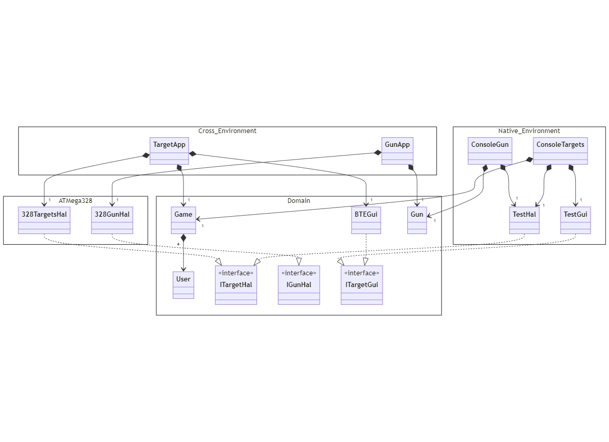

# Five In A Row

Set of applications targetting Atmel/Microchip [ATMega328P](https://www.microchip.com/en-us/product/atmega328p), implementing shooting games.

Using a _gun_, users tries to hit _targets_ managed by a _target host_.
The game is up to four players: yellow, green, red and blue.
There are 5 targets.

### Game mode

Various games will be implemented.

#### Simple shooter

Each player shoot until the five targets are hit. Number of shoots is counted on the gun. Successful hits are counted by the target host and sent to the remote application.

## Functional details

### target

The **target host** application manages player points and turns. It communicates with an Android application implemented on top of [Bluetooth Electronics](https://www.keuwl.com/apps/bluetoothelectronics/) application. It manages the game logic and player points. Various games and modes can be implemented for the host. Each of these could have a specific remote UI.

### Gun

The **Gun** application manages the gun. Using two buttons, it allows:

| Press | Button 1 | Button 2                       |
| ----- | -------- | ------------------------------ |
| short | shoot    | reset shoot count              |
| long  | N/A      | continuous laser (calibration) |

Gun application manages following outputs:

- Laser
- vibrator
- 128x32 I²C display

## Architecture details

Some parts of the projet, implementing logic, can be used on both native and target platform.
All that code is represented in the "domain" package below.

Current target hardware for all applications is the [ATMega328p](https://www.microchip.com/en-us/product/atmega328p) chip from Atmel/Microchip.
To facilitate testing and extension, user interface (Gui) and hardware abstraction (HAL) are provided using interfaces. Implementation exists for native and cross (i.e. testing) environments.

Note: The _BTEGui_ implementation can be used in native environment. Based on plain string exchange, if it may be difficult to interpret.

